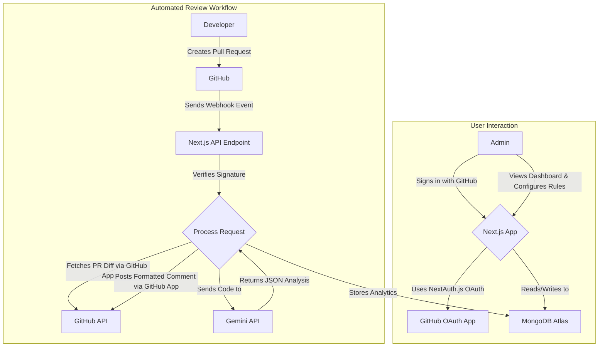

## AI-Powered Code Review Assistant

[](#) [](#) [](#) [](#)

A web-based application that uses AI to automatically review code submissions, identify potential issues, and provide feedback to developers, streamlining the code review process. It integrates directly with your GitHub workflow to catch common errors, enforce coding standards, and free up senior engineers to focus on higher-level design and logic.

[Live Demo](#)

## Key Features

- **Secure GitHub Authentication**: Log in securely using GitHub via NextAuth.js.
- **Automated Pull Request Reviews**: Scans new PRs and posts review comments directly on GitHub.
- **AI-Powered Analysis**: Uses Google Gemini to analyze style, complexity, potential bugs, and best practices.
- **Dynamic Rule Customization**: Create, modify, and manage coding rule sets from the admin dashboard.
- **Admin Analytics Dashboard**: See total PRs reviewed and the five most recent PRs analyzed.
- **CI/CD Integration**: GitHub App + webhooks for seamless, event-driven automation.

## Tech Stack

| **Category** | **Technology** |
| --- | --- |
| Framework | Next.js (App Router) |
| Language | TypeScript |
| Styling | Tailwind CSS |
| UI | shadcn/ui |
| Database | MongoDB (MongoDB Atlas) |
| Auth | NextAuth.js |
| AI/ML | Google Gemini API |
| Deployment | Vercel |

## System Architecture

The application consists of two primary workflows: the user-facing web application and the automated review engine.



## Getting Started

Follow the steps below to set up and run the project locally.

### Prerequisites

- Node.js v18.17+
- npm
- Git
- MongoDB Atlas account (free M0 is sufficient)

### 1) Clone the repository

```bash
git clone https://github.com/your-username/ai-code-review-assistant.git
cd ai-code-review-assistant
```

### 2) Install dependencies

```bash
npm install
```

### 3) Environment variables

Create a `.env.local` file in the project root and copy from `.env.example`:

```bash
cp .env.example .env.local
```

Fill in the values in `.env.local`:

| **Variable** | **Description** |
| --- | --- |
| `MONGODB_URI` | MongoDB connection string from Atlas. |
| `DATABASE_NAME` | Database name (e.g., `ai_code_reviewer`). |
| `NEXTAUTH_URL` | App URL, e.g., `http://localhost:3000` for local dev. |
| `NEXTAUTH_SECRET` | Secret for NextAuth.js. Generate with `openssl rand -hex 32`. |
| `GITHUB_ID` | Client ID from your GitHub OAuth App. |
| `GITHUB_SECRET` | Client Secret from your GitHub OAuth App. |
| `GITHUB_APP_ID` | App ID from your GitHub App (automation). |
| `GITHUB_PRIVATE_KEY` | Multi-line private key from your GitHub App. Wrap in double quotes. |
| `GITHUB_WEBHOOK_SECRET` | Webhook secret defined for your GitHub App. |
| `GEMINI_API_KEY` | API key for the Google Gemini API. |

### 4) Run the development server

```bash
npm run dev
```

The application will be available at `http://localhost:3000`.

## Deployment

This application is optimized for deployment on Vercel.

1. Push your code to a GitHub repository.
2. Import the repository into Vercel.
3. Add environment variables from `.env.local` to your Vercel project settings.
4. Update callback URLs in your GitHub OAuth App and GitHub App to your Vercel production URL.

## License

This project is licensed under the MIT License — see the `LICENSE` file for details.